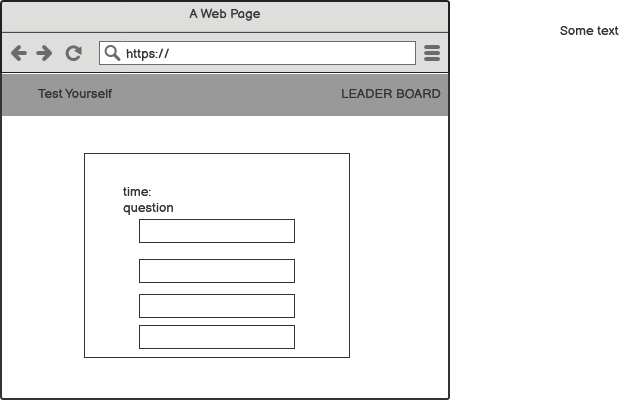

# QUIZ #

## Milestone Portfolio Project 2 - JavaScript Essentials - Code Institute Full Stack Developer Diploma ###

by Heli Saarts

***

This site was developed for Educational purposes

***

### Table of contents ####

***

### Introduction

Welcome to my very first game! For this project I have chosen a simple quiz.

User Story

* Introduction Screen & Explanation.
* User Clicks Start to begin the quiz.
* The Timer Starts counting down.
* The first question appears (all questions are multiple choice).
* The user selects the answer and next question appears.
* Total correct answers are added as the user goes through the quiz.
* Settings: Total Number of Questions, Total Time, Clear LeaderBoard, turn random on/off (of the questions) are settings within the code.

This website was built as part of the learning material for Code Institute's Fullstack Web Developer program (5P) Portfolio. For this project the emphasis has been on the javascript learning over html or CSS styling.

***

### Design Goals

---

* The design goals of this project is develop a simple responsive quiz, where the user completes multiple choice questions.

* Design Features

* Introduction Screen with basic instructions for the user.

* Display of Timer, Username and Score at the top of the screen.
* Access to leaderboard through menu option.
* Access to settings menu, to configure the game (to be developed).
* Question list stored in an array. Option to read in file which separately stores the questions. (to be developed)

### Color choice

As this is a Quiz Game, a simple bright palette was used.

### Wireframes

---
Wireframes of the user interface for Mobile & Desktop using balsamic.

### Desktop Wireframe Quiz Question

### Desktop Wireframe Quiz Completed

### Desktop Wireframe Quiz Leader Board

### Mobile Wireframe Quiz Question

## Development

---

* Outline functionality/pseudo code.
* Webpage to display introduction.
* Webpage to display a Question (which is dynamically loaded with javascript).
* Webpage to display results.
* Header/Navigation bar.
* Webpage for settings.
* Webpage for leaderboard.

### CSS
Minimal styling was used on this project. Allowing the user to focus on the questions.

### Javascript

* Variables.
* Array to store questions.
* Timer, Username.

### Functions

* Load questions.
* GetUserName.
* Display first question.
* Randomization of questions (on/off).
* Start Quiz.
* Start Timer.
* Stop Timer.
* Timer Set Time for Quiz.
* ShowResult.
* EventListener for Start Button.
* EventListener for Submit Button
* EventListener for LeaderBoard.
* Create LeaderBoard.
* Update LeaderBoard.
* Clear LeaderBoard.

## Testing

***

Functional Testing:

* Randomisation on/off.

* Automated  testing was carried out on the Quiz with Randomization turned off.

* The automated testing was completed using the Lighthouse recorder. Example screenshots:

The second screenshot shows a failed test due to random question content. This is one key area that can make games testing difficult.

* A number of recordals were created to complete the testing of questions, with answers all being correct, answers all being wrong and a mixture of right and wrong.

* Randomisation was turned on at the end, and a number of manual test passes were completed to confirm that the questions appeared randomly. When the automated scripts are run against random questions the scripts fail as expected, as the question order changes upon each playback.

### Manual Testing

`Note: There are 10 questions within this Quiz.`
* Manual tesing- UI

1. README in GitHub repository describing the project.
2. Code Institute Template with Gitpod.
3. Visually check all pages must have the correct layout and text is readable.
4. All colors are exactly same as chosen in the color pallette.

* Open Quiz website with the link provided.
Click on LeaderBoard  
  * Expected Result:

   This should be empty on the first execution of this step.

* Click on "Start Again"

  * Expected Result:  Simple Quiz Page appears

* Click on "Start Quiz"

  * Expected Result: First Question Appears
Check Time is decreasing

Test Pass 1:

* Answer all questions correctly referencing the questions and answers in the javascript code.

Test Pass 2:

* Answer all questions incorrectly referencing the questions and answers in the javascript code.

Test Pass 3:
* Answer some questions incorrectly and correctly referencing the questions and answers in the javascript code.

When an Answer is answered incorrectly. Expected Result Time is reduced by 10 seconds.

Quiz Completed Page

* Click on Submit Expected Result Alert Appears as the "Your Name" input is a required field.
* Enter Username in "Your Name:"input field and Click on Submit
  * Expected Result: Leader Board appears
with Username and Score of completed Quiz.
* Click on "Clear LeaderBoard" Button
  * Expected Result - Entries on Leaderboard are removed.

### Technology

* Github- software hosting platform to keep the project in a remote location.

* Gitpod - a development hosting platform.

* Git - used for version control.

### Validators

* jshint
  * (<https://jshint.com/>)

Warnings for const and let were ignored as this appears to be a configuration issue with the linter. I didn't have the time to investigate this further.

* (<https://stackoverflow.com/questions/54647294/const-is-available-in-es6-use-esversion-6>)

validator.w3.org

* (<https://validator.w3.org/nu/#textarea>)
CSS and HTML code was checked with validator on w3. Screenshots of the results are as follows:

### CSS Validation

### HTML Validation

Lighthouse testing was completed within the Chrome DevTools.
### Desktop Lighthouse

### Mobile Lighthouse

<https://codebeautify.org/cssvalidate>
<https://webaim.org/>

## Deployment

The project was developed in Gitpod, linked to Gihub for version control.

The webpage was deployed to the following location:
### Deployment URL on Github

* HTML5 - A programming language for structuring the site.

* CSS3- Style sheet programming language.

* JavaScript - A scripting language that enables the creation of dynamically updating content.

* Font Awesome -used to provide icon to the result-box.

* Google fonts -used to select and provide typography.

## Future Aspirations

Features that I would like to have added to this project:
- Configuration Menu within the User Interface for Game Settings.
- Externalise questions to a separate file, e.g. JSON format.
### Free Fonts, Icons

Fonts chosen: 'Poppins', sans-serif;

* <https://fonts.google.com>
* <https://fontawesome.com>

***

## References

* [w3school](https://www.w3schools.com/css/>)
* [markdownguide](https://www.markdownguide.org/cheat-sheet/)
* [webdesign.tutsplus](https://webdesign.tutsplus.com/)
* [geeksforgeeks](https://www.geeksforgeeks.org/)
* [scrimba](https://scrimba.com/)
* [whatimarkdown](https://whatismarkdown.com/category/)
* [javascript psj5](https://p5js.org/)
* [media query](https://jackdomleo.dev/blog/2020/hover-css-media-query/)

---

### Quizzes

* <https://www.youtube.com/watch?v=MxrGPP4F8Sc>

* <https://www.youtube.com/watch?v=riDzcEQbX6k>
* <https://www.youtube.com/watch?v=f4fB9Xg2JEY>
* <https://github.com/stephje/javascript-quiz>

### Quiz questions and answers

* <https://triviaquiznight.com>
(easy-general-knowledge-questions-and-answers/)

* <https://kwizzbit.com/50-general-knowledge-quiz-questions-and-answers/>

### Data Import JSON

(Reference to store questions outside of Javascript file in a separate file - not implemented, lack of time)

* <https://www.youtube.com/watch?v=lO1d-pXeJW4>
* <https://github.com/iamevenstronger/quiz>
* <https://iamevenstronger.github.io/quiz/index.html>

### Randomisation of arrays in javascript

* <https://www.w3docs.com/snippets/javascript/how-to-randomize-shuffle-a-javascript-array.html>
* <https://javascript.info/task/shuffle>
<https://www.webmound.com/shuffle-javascript-array/>

### Used for color choices and create the color pallet

* <https://www.coolors.co/>

### Used fo screenshot

* <https://www.screenpresso.com/>
